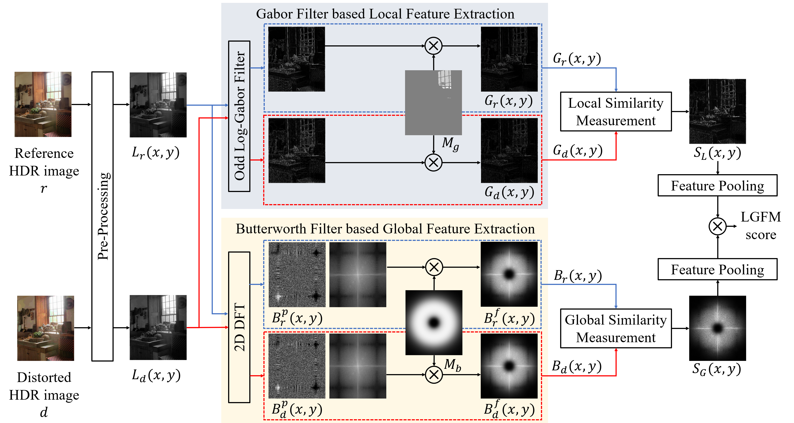
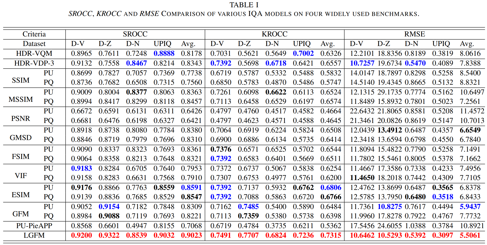

# High Dynamic Range Image Quality Assessment Based on Frequency Disparity


### IEEE Transactions on Circuits and Systems for Video Technology (T-CSVT) 
### [[Paper-arXiv](https://arxiv.org/abs/2209.02285)] [[Paper-official](https://ieeexplore.ieee.org/abstract/document/10021986)] 

Yue Liu, [Zhangkai Ni](https://eezkni.github.io/), Shiqi Wang, Hanli Wang, and Sam Kwong

## Introdcurion

This website shares the codes of the "High Dynamic Range Image Quality Assessment Based on Frequency Disparity", IEEE Transactions on Circuits and Systems for Video Technology (T-CSVT), vol. 33, no. 8, pp. 4435-4440, January 2023. 


## Abstract

In this paper, a novel and effective image quality assessment (IQA) algorithm based on frequency disparity for high dynamic range (HDR) images is proposed, termed as local-global frequency feature-based model (LGFM). Motivated by the assumption that the human visual system (HVS) is highly adapted for extracting structural information and partial frequencies when perceiving the visual scene, the Gabor and the Butterworth filters are applied to the luminance component of the HDR image to extract the local and global frequency features, respectively. The similarity measurement and feature pooling strategy are sequentially performed on the frequency features to obtain the predicted single quality score. The experiments evaluated on four widely used benchmarks demonstrate that the proposed LGFM can provide a higher consistency with the subjective perception compared with the state-of-the-art HDR IQA methods.

## Installation
```
git clone https://github.com/eezkni/LGEM --recursive
cd LGFM
```
Note that LGFM requires [HDR Toolbox](https://github.com/banterle/HDR_Toolbox).

## Local-global frequency feature-based model for HDR image Quality Assessment
<div align=center></div>


## Experimental Results
<div align=center></div>

## Citation

If this code/LGFM is useful for your research, please cite our paper:

```
@article{liu2023high,
  title={High Dynamic Range Image Quality Assessment Based on Frequency Disparity},
  author={Liu, Yue and Ni, Zhangkai and Wang, Shiqi and Wang, Hanli and Kwong, Sam},
  journal={IEEE Transactions on Circuits and Systems for Video Technology},
  year={2023},
  publisher={IEEE}
}
```

## Contact

Thanks for your attention! If you have any suggestion or question, feel free to leave a message here or contact Miss. Yue Liu (yliu724-c@my.cityu.edu.hk).


## License

[MIT License](https://opensource.org/licenses/MIT)
